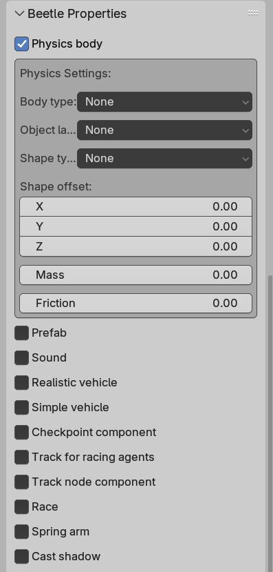

In our racing engine, Blender is the level editor. Artists and designers set up scenes, assign custom properties to objects, and export to glTF. The engine reads those properties and uses them to create the right components, like physics bodies, sounds, splines, prefabs, without any editor in the engine. This post covers how that pipeline works.

## Custom Properties in Blender

Blender addons can register custom properties on objects and display them in panels:

```python
bpy.types.Object.physics = bpy.props.BoolProperty(
    name="Physics body",
    description="Enable physics body",
    default=False
)

class OBJECT_PT_object_properties(bpy.types.Panel):
    bl_label = "Beetle Properties"
    bl_idname = "OBJECT_PT_object_properties"
    bl_space_type = "PROPERTIES"
    bl_region_type = "WINDOW"
    bl_context = "object"

    def draw(self, context):
        layout = self.layout
        obj = context.object
        layout.prop(obj, "physics")
        if obj.physics:
            box = layout.box()
            box.prop(obj, "body_type")
            box.prop(obj, "shape_type")
            box.prop(obj, "mass")
            box.prop(obj, "friction")
```

When exported to glTF, these properties end up in the node's `extras` JSON field. Anything you can represent as a bool, int, float, string, or an array of those types can be exported through this pipeline.

## Parsing Extras in C++

On the engine side, we use fastgltf for loading. It provides an extras callback that is called per node, giving you a simdjson object to parse:

```cpp
void Model::ExtrasCallback(simdjson::dom::object* extras,
                           std::size_t objectIndex,
                           fastgltf::Category category,
                           void* userPointer)
{
    if (!extras) return;
    Model* model = static_cast(userPointer);

    for (auto [key, value] : *extras)
    {
        std::string keyStr = std::string(key);
        auto& [extraData] = model->m_extras[objectIndex];

        if (value.is_int64())
        {
            int64_t val = 0;
            value.get_int64().get(val);
            extraData[keyStr] = static_cast(val);
        }
        // ... same for float, bool, string, arrays
    }
}
```

The parsed data is stored per node index using `std::variant` to handle all the types that the Blender properties can create:

```cpp
using GLTFExtra = std::variant<
    float, int, bool, std::string,
    std::vector, std::vector,
    std::vector, std::vector,
    std::vector<std::vector>
>;

struct GLTFExtras
{
    std::unordered_map data;
};
```

During instantiation, if a glTF node has extras, they get stored in a component:

```cpp
auto it = m_extras.find(nodeIdx);
if (it != m_extras.end())
{
    Engine.ECS().CreateComponent(entity, it->second.data);
}
```

## Converting Extras to Components

After loading a scene, one pass over all `GLTFExtras` components creates the actual components. Each property maps to specific setup logic:

```cpp
for (auto [entity, extras] : Engine.ECS().Registry.view().each())
{
    auto physicsIt = extras.data.find("physics");
    if (physicsIt != end && std::get(physicsIt->second))
    {
        auto& rigidBody = Engine.ECS().CreateComponent(entity);
        // read body_type, shape_type, mass, friction from extras...
    }

    auto soundIt = extras.data.find("sound");
    if (soundIt != end && std::get(soundIt->second))
    {
        auto eventIt = extras.data.find("sound_event");
        std::string event = (eventIt != end)
            ? std::get(eventIt->second) : "";
        Engine.ECS().CreateComponent(entity, event);
    }
}
```

This is essentially a data driven entity factory. Adding a new component type to the pipeline means: register a Blender property, add a branch in this loop. Nothing else.

## Prefabs

One property we added is `prefab`: a path to another glTF file. When the converting loop processes it, it instantiates that glTF into the scene. This lets designers swap assets (different vehicles, different track props) by changing a string in Blender instead of restructuring the scene.

Blender already has file linking for referencing objects across .blend files, which we used for collaboration. Prefabs solved a different problem: swapping what gets loaded at a point in the scene without restructuring the Blender file just change a path string and re-export.

## The Full Pipeline

The workflow for adding any new configurable object type:

1. Add a property in the Blender addon.
2. Export (properties are exported as glTF extras automatically).
3. Add a branch in the converting loop that reads the extras and creates the right components.
4. Designers configure everything in Blender.

This kept the iteration loop short: edit in Blender, press export, reload in engine. Everything configurable lives in one place.
