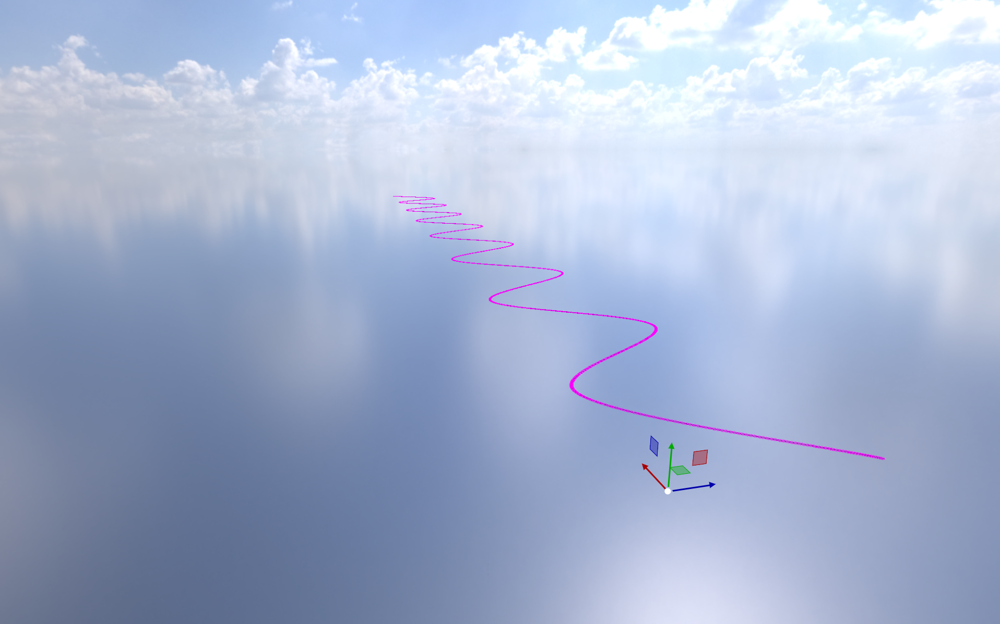

Our racing game needed splines for three things: tracking race progress, guiding AI drivers, and drawing a minimap. We were already using Blender as our level editor and glTF as our scene format, so the goal was simple: create a Bézier curve in Blender, export it, and reconstruct it exactly in engine.

The problem: glTF doesn't support splines. The exporter ignores curve objects entirely.

## Hooking into Blender's glTF Exporter

Blender's glTF exporter has a hook called `gather_node_hook` that is called for every object being exported. You can use it to inspect the Blender object and inject data into the glTF node's extras (a JSON field that most engines and loaders can access).

The idea: detect Bézier curve objects, read their control points and handles, and pack them as flat float arrays in extras.

```python
def gather_node_hook(self, gltf_node, blender_object, export_settings):
    if blender_object.type == 'CURVE' and blender_object.data.splines:
        if any(spline.type == 'BEZIER' for spline in blender_object.data.splines):
            bezier_curve_point = []
            bezier_curve_handle_left_offset = []
            bezier_curve_handle_right_offset = []

            for spline in blender_object.data.splines:
                if spline.type == 'BEZIER':
                    for point in spline.bezier_points:
                        control_point = point.co
                        handle_left_offset = point.handle_left - control_point
                        handle_right_offset = point.handle_right - control_point

                        bezier_curve_point.extend([
                            control_point.x, control_point.z, -control_point.y
                        ])
                        bezier_curve_handle_left_offset.extend([
                            handle_left_offset.x, handle_left_offset.z, -handle_left_offset.y
                        ])
                        bezier_curve_handle_right_offset.extend([
                            handle_right_offset.x, handle_right_offset.z, -handle_right_offset.y
                        ])

            if bezier_curve_point:
                if not hasattr(gltf_node, "extras") or not isinstance(gltf_node.extras, dict):
                    gltf_node.extras = {}

                gltf_node.extras["bezier_curve_point"] = bezier_curve_point
                gltf_node.extras["bezier_curve_handle_left"] = bezier_curve_handle_left_offset
                gltf_node.extras["bezier_curve_handle_right"] = bezier_curve_handle_right_offset
```

Three things to note:

**Coordinate system conversion.** Blender is Z-up, our engine (and glTF convention) is Y-up. So we swap Y and Z and negate the new Y: `(x, z, -y)`. Skip this and your spline will be sideways.

**Handles are stored as offsets**, not absolute positions. This keeps them relative to their control point.

**Three separate arrays:** control points, left handle offsets, right handle offsets. On the engine side, you read them in groups of three floats to reconstruct `vec3` positions. This is flat and simple rather than trying to pack nested structures into glTF extras.

## Reconstructing the Curve in Engine

On the C++ side, the engine reads these float arrays from the glTF extras and reconstructs the curve with cubic Bézier interpolation:

```cpp
glm::vec3 CubicBezierInterpolate(const glm::vec3& p0, const glm::vec3& p1,
                                  const glm::vec3& p2, const glm::vec3& p3, float t)
{
    const float tt = 1 - t;
    return tt*tt*tt * p0 + 3*tt*tt*t * p1 + 3*tt*t*t * p2 + t*t*t * p3;
}
```

For each segment between two control points, p0 is the current point, p1 is the current point's right handle, p2 is the next point's left handle, and p3 is the next point.

```cpp
for (size_t i = 0; i < points.size() - 1; ++i)
{
    glm::vec3 p0 = std::get<0>(points[i]);       // control point
    glm::vec3 p1 = std::get<2>(points[i]);       // right handle
    glm::vec3 p2 = std::get<1>(points[i + 1]);   // next left handle
    glm::vec3 p3 = std::get<0>(points[i + 1]);   // next control point

    for (int j = 0; j < spline.resolution; ++j)
    {
        float t = static_cast(j) / spline.resolution;
        spline.cachedPoints.push_back(CubicBezierInterpolate(p0, p1, p2, p3, t));
    }
}
```

The spline component itself is minimal: a resolution, a dirty flag, and the cached output:

```cpp
struct Spline
{
    int resolution = 12;
    bool dirty = true;
    std::vector cachedPoints;
};
```

The result matches Blender exactly because we're using the same interpolation (standard cubic Bézier) and exporting the raw data Blender uses internally.
