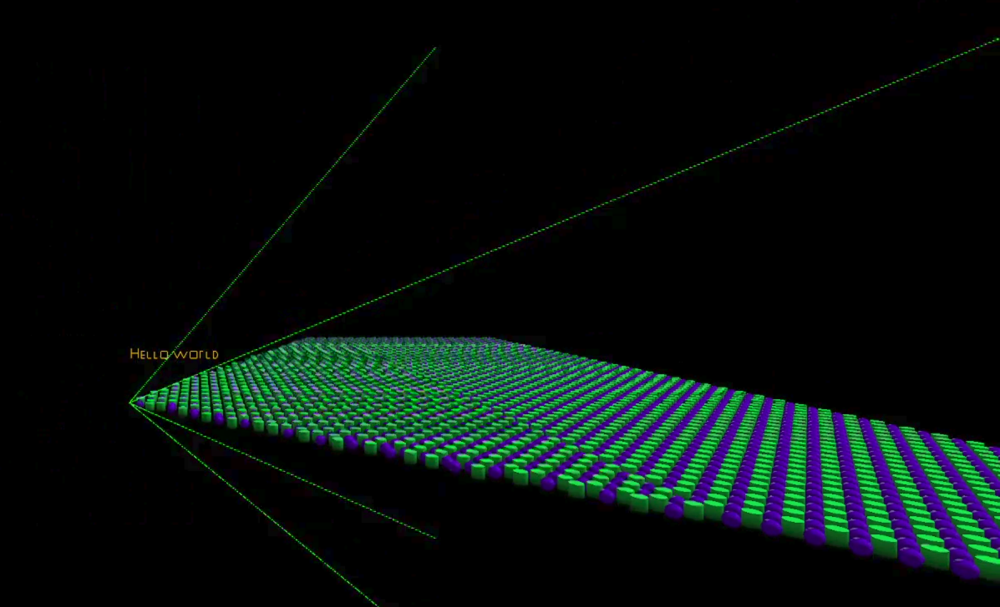
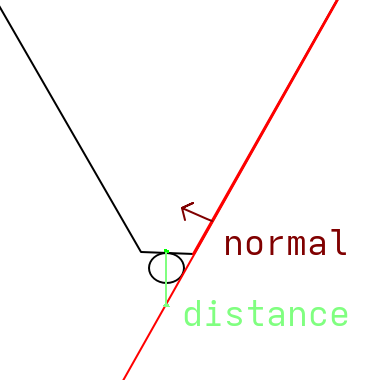

When rendering objects, you might think that if they fall outside the frame, the GPU automatically handles that for you. And it does, but not for free. It still has to process every object, rasterize it, and only then discard the fragments that fall outside the view. Frustum culling solves this by rejecting objects earlier in the pipeline, before any rasterization work is done. The frustum is the shape of the camera's view, and culling is just the process of discarding what falls outside it.

In this post I cover how to represent a frustum mathematically, how to test objects against it, and how I integrate it with my GPU-driven pipeline from [Driving my Renderer with the GPU](../pages/gpu_driven).

### Represent Represent!
A frustum can be represented as 6 planes. Each plane divides space into two halves: inside and outside. An object is visible if it is on the inside of all 6 planes at the same time. If for any of the tests it fails, it is outside and can be skipped.

Each plane is stored as a normal vector pointing inward and a distance from the origin:


```cpp
struct Plane
{
  glm::vec3 normal;
  float distance;
};

struct Frustum
{
  Plane left;
  Plane right;

  Plane bottom;
  Plane top;

  Plane near;
  Plane far;
};
```




Now you’ll need to get the 6 planes for your current camera's transform from somewhere. The easiest way is to use the projection (and view) matrix. This is based on the [paper by Gribb and Hartmann](https://www.gamedevs.org/uploads/fast-extraction-viewing-frustum-planes-from-world-view-projection-matrix.pdf).


```cpp
inline Plane ExtractPlane(const glm::mat4& matrix, PlaneType type)
{
  const auto row1 = glm::row(matrix, 0);
  const auto row2 = glm::row(matrix, 1);
  const auto row3 = glm::row(matrix, 2);
  const auto row4 = glm::row(matrix, 3);

  glm::vec4 result{};
  switch (type)
  {
    case PlaneType::Left:
      result = row4 + row1;
      break;
    case PlaneType::Right:
      result = row4 - row1;
      break;
    case PlaneType::Bottom:
      result = row4 + row2;
      break;
    case PlaneType::Top:
      result = row4 - row2;
      break;
    case PlaneType::Near:
      result = row4 + row3;
      break;
    case PlaneType::Far:
      result = row4 - row3;
      break;
  }

  const auto normal = glm::vec3(result);
  const float length = glm::length(normal);
  const glm::vec3 normalized = normal / length;
  const float distance = result.w / length;
  return Plane{.normal = normalized, .distance = distance};
}
```


Each plane is extracted by adding or subtracting rows of the view projection matrix. The left plane is `row4 + row1`, the right is `row4 - row1`, and so on. This comes directly from the paper, which derives each plane equation. The result is then normalized so the distance value is meaningful for the point test.

If you want to know more about these plane equations, the paper is worth reading. The math is approachable if you are comfortable with homogeneous coordinates.

### Testing an object

With the frustum as 6 planes, testing a point is a dot product. For each plane, calculate the distance from the plane to the point. If the distance is negative, the point is on the outside. If it is outside any of the planes, the point is not inside the frustum.

Testing a single point works for small objects but fails for larger ones that might overlap a frustum plane. Instead, we go through each plane and test the 8 corners of the object's AABB. If all 8 corners are outside any of the planes, the entire object is outside the frustum and can be skipped.

You can do this test on the CPU, where you loop through every object and only submit a draw call if it is visible. That works, but it still requires the CPU to process every object every frame. Moving the test into the compute shader means all objects are tested in parallel on the GPU. However, this does require you to have some sort of GPU-driven setup.


```cpp
bool isOnFrustum(Frustum frustum, MeshInfo info, float4x4 world) {
  const float3 corners[8] = {
    mul(world, float4(info.bmin.x, info.bmin.y, info.bmin.z, 1.0)).xyz,
    ...
    mul(world, float4(info.bmax.x, info.bmax.y, info.bmax.z, 1.0)).xyz,
  };

  Plane planes[6] = {frustum.left, frustum.right, frustum.bottom, frustum.top, frustum.near, frustum.far};

  for (int i = 0; i < 6; i++) {
    bool allOutside = true;

    for (int j = 0; j < 8; j++) {
      if (dot(planes[i].normal, corners[j]) + planes[i].distance >= -0.001) {
        allOutside = false;
        break;
      }
    }

    if (allOutside) {
      return false;
    }
  }
  return true;
}
```


The bounding box min and max are stored per mesh in the mesh info buffer, already available in the compute shader. Each corner is transformed to world space using the object's model matrix before testing.

All the objects that pass the test write their draw command and increment the draw count. Objects that fail are simply skipped.


```cpp
if (isOnFrustum(pushConst.frustum, info, obj.model)) {
  uint countedIndex;
  InterlockedAdd(drawCount[0], 1, countedIndex);

  outputCommands[countedIndex].indexCount = info.indexCount;
  outputCommands[countedIndex].instanceCount = 1;
  outputCommands[countedIndex].firstIndex = info.firstIndex;
  outputCommands[countedIndex].vertexOffset = info.vertexOffset;
  outputCommands[countedIndex].firstInstance = index;
}
```


### Conclusion
The improvement scales directly with how many objects fall outside the view. In scenes with a lot of geometry the compute shader discards the majority of objects before any rasterization work happens. The only CPU work per frame is recalculating and uploading the frustum, which is six plane equations.
