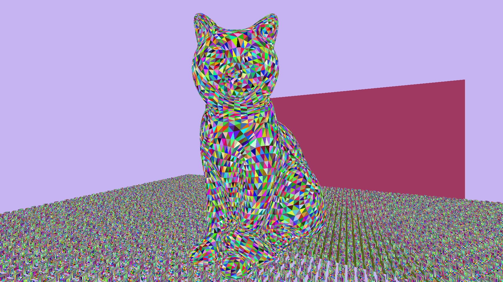
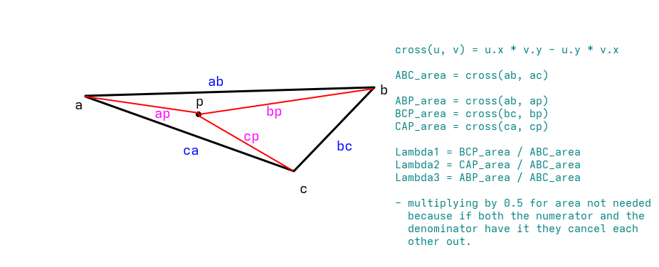
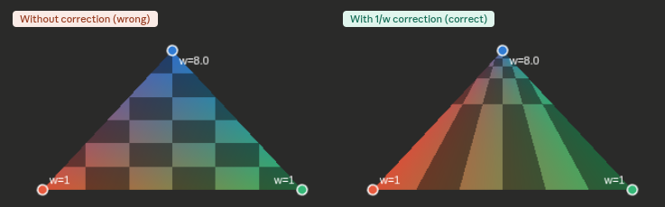
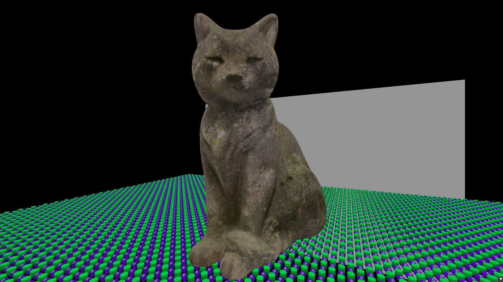

At first, we used forward rendering. A naive way to render everything in a single pass. It caused overdraw and didn't scale well with many lights, but it was simple. At some point, we realized that the geometry and shading needed to be handled separately. That was called deferred rendering. It made many lights much cheaper, but introduced a heavy G-buffer. The G-buffer is a collection of render targets. Typically storing normals, albedo, position, and material properties, each 16 to 32 bytes per pixel. The geometry pass still writes every fragment including ones that get overwritten by closer geometry, so you're still paying bandwidth for overdraw. MSAA and transparency also become significantly harder. Forward+ addressed some of these issues but the fundamental overdraw problem remains.

The visibility buffer takes the split between geometry and shading even further. Instead of storing interpolated attributes, the first pass now only stores what's needed to reconstruct them: a triangle ID and a draw ID packed into a single uint32. Four bytes per pixel, fixed cost no matter how complex the scene is. The second pass reconstructs everything from scratch, but only for pixels that are actually visible.

### Pass 1: The thin G-buffer
The pre-pass is a normal rasterization pass which, for each pixel, stores which triangle covered it. That's it. No lighting, no attributes, no material data. Just a triangle ID and a draw ID packed into a single uint32 and written to a single render target.

So the fragment shader would look something like this:


```cpp
uint main(VertexOutput input, uint primitiveID : SV_PrimitiveID) : SV_Target
{
  uint packed = (primitiveID << 16) | (input.drawID & 0xFFFF);
  return packed;
}
```


The primitive ID comes from the rasterizer, the draw ID is passed through from the vertex shader. The upper 16 bits store the primitive ID, the lower 16 the draw ID. One 32 bit integer per pixel.

The draw ID isn't directly available in the fragment shader. `SV_DrawIndex` is vertex shader only. So you have to pass it through.

One thing to note here is that, using `SV_PrimitiveID` in the fragment shader requires declaring a capability in SPIR-V. Either geometry shaders, tessellation, or mesh shaders. Without this the pesky validation layers will complain. The simplest solution is enabling the geometry shader feature on your device, even if you're not actually using geometry shaders.

As a quick visualization, I’ve assigned a unique color to each triangle here.



### Pass 2: Reconstruction
In a normal deferred renderer, the hardware rasterizer interpolates vertex attributes automatically and writes them to the G-buffer. In pass 2 there is no rasterizer. A compute shader runs over every pixel, unpacks the triangle and draw IDs, and reconstructs the attributes manually.

The compute shader would look something like this:


```cpp
void main(uint3 dispatchThreadID : SV_DispatchThreadID)
{
  uint2 pixel = uint2(dispatchThreadID.xy);

  uint packed = visibilityImage.Load(int3(pixel.x, pixel.y, 0));
  if (packed == 0xFFFFFFFFu) {
    renderImage[pixel] = float4(float3(0.0), 1.0);
    return;
  }

  uint primitiveID = packed >> 16;
  uint drawID = packed & 0xFFFF;
  DrawIndexedIndirectCommand command = outputCommands[drawID];
  RenderObject object = renderObjects[command.firstInstance];

  uint triangle_0 = indexBuffer[command.firstIndex + primitiveID * 3 + 0];
  uint triangle_1 = indexBuffer[command.firstIndex + primitiveID * 3 + 1];
  uint triangle_2 = indexBuffer[command.firstIndex + primitiveID * 3 + 2];

  VertexInputShading vertex_0 = vertexBuffer[command.vertexOffset + triangle_0];
  VertexInputShading vertex_1 = vertexBuffer[command.vertexOffset + triangle_1];
  VertexInputShading vertex_2 = vertexBuffer[command.vertexOffset + triangle_2];

...
```


Each pixel unpacks the two IDs. The visibility image is cleared to `0xFFFFFFFF` before the pre-pass, so any pixel that was never written to, such as sky or empty space, will still hold that value and gets skipped. Otherwise the draw ID indexes into the indirect command buffer to get the object ID. In this renderer the object ID is stored in `firstInstance` of the indirect draw command, but it could come from anywhere as long as the pre-pass and the shading pass agree on how to look it up. From the object you get the mesh, and from the mesh you get the index and vertex buffer offsets. Three index lookups give you the three vertices of the triangle that covered this pixel.

If you want to know more about how the indirect command buffer is set up and why `firstInstance` stores the object ID, I cover that in [Driving my Renderer with the GPU](../pages/gpu_driven).

#### Screen Space Barycentrics
The hardware rasterizer normally interpolates vertex attributes automatically. Like I mentioned before, there is no rasterizer in pass 2, so the attributes have to be reconstructed manually. To do that, the position of the current pixel within the triangle needs to be expressed as a weighted combination of the three vertices. Those weights are the barycentric coordinates.

The idea is simple: the weight of each vertex is equal to how close the pixel is to that vertex. More precisely, it is the area of the sub triangle opposite to that vertex divided by the total triangle area. These areas are computed with 2D cross products after projecting the vertices to screen space. Now I understand that might seem like a bunch of mathematical gibberish. At first it did for me too. So I created a little (primitive) sketch to help myself understand, and I think it could help here too.



Before calculating the areas, the vertex positions need to be projected to screen space. This is done by multiplying each vertex position by the same MVP matrix used in the pre-pass, then dividing XYZ by W to get Normalized Device Coordinates (NDC), and finally remapping from the NDC range to pixel coordinates. In code that would look something like this:


```cpp
float4x4 mvp = mul(pushConst.proj, mul(pushConst.view, object.model));
float4 clip_0 = mul(mvp, float4(vertex_0.position, 1.0));
float4 clip_1 = mul(mvp, float4(vertex_1.position, 1.0));
float4 clip_2 = mul(mvp, float4(vertex_2.position, 1.0));

float3 ndc_0 = clip_0.xyz / clip_0.w;
float3 ndc_1 = clip_1.xyz / clip_1.w;
float3 ndc_2 = clip_2.xyz / clip_2.w;

float2 screen_0 = (ndc_0.xy * 0.5 + 0.5) * ubo.viewport;
float2 screen_1 = (ndc_1.xy * 0.5 + 0.5) * ubo.viewport;
float2 screen_2 = (ndc_2.xy * 0.5 + 0.5) * ubo.viewport;

float2 pixel_pos = (float2)pixel + 0.5; // get the center of the pixel
```


With the vertices and the pixel in screen space, the areas can be calculated. `abc` is the total triangle area. `bcp`, `cap` are the areas of the two sub triangles, calculated with 2D cross products. The third barycentric coordinate doesn't need its own cross product since all three must add up to 1.


```cpp
// calculate the areas of the full triangle and the 3 smaller triangles inside
float2 ab = screen_1 - screen_0;
float2 ac = screen_2 - screen_0;
float abc = cross2d(ab, ac);

float2 bc = screen_2 - screen_1;
float2 bp = pixel_pos - screen_1;
float bcp = cross2d(bc, bp);

float2 ca = -ac;
float2 cp = pixel_pos - screen_2;
float cap = cross2d(ca, cp);

// calculate the barycentric coords. Not taking in account the depth they have.
float bary_0 = bcp / abc;
float bary_1 = cap / abc;
float bary_2 = 1.0 - bary_0 - bary_1;
```


There is a problem with the barycentric weights calculated in screen space. Perspective projection is non-linear, so interpolating linearly in screen space does not match what the correct 3D interpolation would be. Attributes like UVs and normals end up visibly wrong, especially on triangles at an angle to the camera. This is the perspective correction problem, and it is exactly what the hardware interpolator solves automatically in normal rendering



The fix is to weight each barycentric coordinate by `1/clip.w` for its vertex. Vertices that are further away get a smaller weight, which counteracts the distortion introduced by the perspective divide. After multiplying by these depth weights the coordinates no longer add up to 1, so they need to be normalized again by dividing by their sum.


```cpp
float inv_w0 = 1.0 / clip_0.w;
float inv_w1 = 1.0 / clip_1.w;
float inv_w2 = 1.0 / clip_2.w;

float b0w = bary_0 * inv_w0;
float b1w = bary_1 * inv_w1;
float b2w = bary_2 * inv_w2;

float inv_denom = 1.0 / (b0w + b1w + b2w);

float3 color = (vertex_0.color * b0w + vertex_1.color * b1w + vertex_2.color * b2w) * inv_denom;
float2 uv = (vertex_0.tex_coord * b0w + vertex_1.tex_coord * b1w + vertex_2.tex_coord * b2w) * inv_denom;
float3 normal = (vertex_0.normal * b0w + vertex_1.normal * b1w + vertex_2.normal * b2w) * inv_denom;
```

This solves the problem. It is the same thing the hardware interpolator does automatically in a normal rendering pass.




##### ...WIP...
