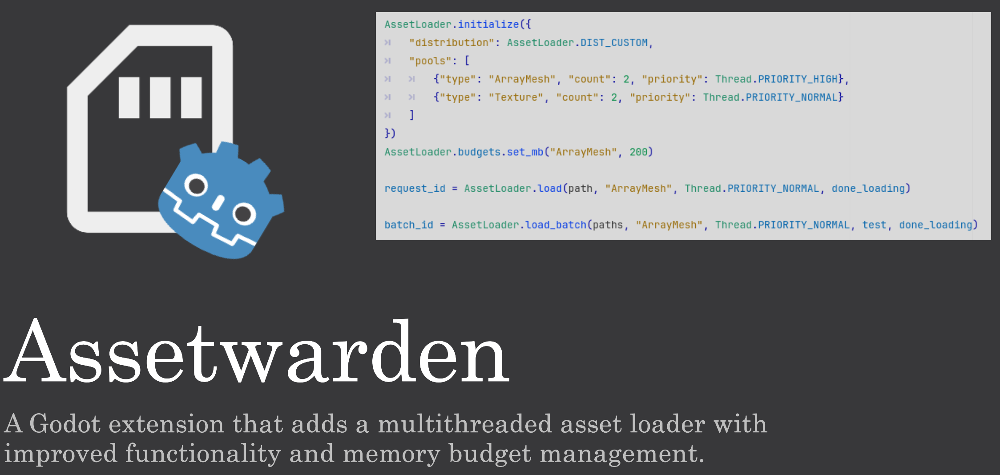

- **Solo**
- **Role:** Engine & Tools programmer
- **Duration:** 8 weeks
{:.project-table}

For **block A** of my **third year** at **BUAS** I built an **extension** in **C++** for **Godot** that handles **async asset loading** with a priority thread pool, **memory budget** enforcement, and editor tooling. Loads **256** meshes (~600MB) across multiple threads while maintaining **60 FPS**, with a **callback API** for completion handling and a custom editor panel for real-time performance **visualization**.

##### ...WIP...
