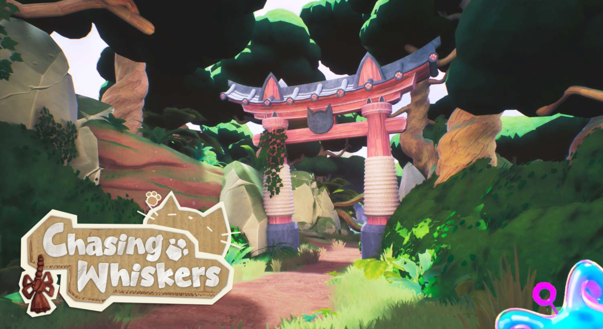

- **Team size:** 24
- **Role:** Gameplay Programmer
- **Duration:** 16 weeks
{:.project-table}

For **block B and C** of my **third year** at **BUAS** I worked together with a team to create a cozy and playful **adventure game** where you play as a grandma catching cats to help a tanuki find your lost cat.

I built **gameplay** systems in **C++** and **Blueprints** in **Unreal Engine**. I primarily worked on the **3Cs**:

- **Player character** with a **state machine** driving per-state behaviour for idle, walking, sprinting, jumping, falling, diving, and sliding
- **Smooth character rotation system** where turn speed scales with velocity, with snap rotation for sharp direction changes
- **Dive & slide system**: forward launch, physical forces taking in account slope angle and air steering
- **Third-person camera controller** with custom systems handling distance, height smoothing, and lag. All transitioning dynamically based on player state
- Checkpoint-based **respawn system** that validates grounded state, open space, and distance before saving.

## Details

### Player character with smooth rotation system
The player character is the center of the gameplay systems, built in C++ on top of Unreal's `ACharacter`. A state machine runs each tick, checking conditions to determine the current state and calling enter/exit callbacks on transitions. Each state has its own update function, keeping per-state logic isolated. States also drive other systems: gravity scale, rotation speeds, and camera lag all read the current state to apply different values throughout the codebase.

Inspired by and expanded from an idea from [Tom Baas's Viking Hiking project](https://tom-baas.nl/front-page/viking-hiking/). Rather than instantly orienting the character toward input, rotation speed is mapped to velocity. Turning slowly at low speed and more sharply at high speed, which gives the movement a more grounded, physical feel. To handle sharp direction reversals cleanly, the system tracks the angular velocity of the target rotation each frame and triggers a fast snap rotation when both the angle difference and angular velocity exceed configurable thresholds. Movement input magnitude is also reduced when the character is facing away from the desired direction, preventing the character from sliding sideways at the start of a turn. All rotation parameters support per-state overrides via a data asset, so sprinting and walking can have distinctly different turn behaviour.

<video controls src="assets/videos/chasing_whiskers/smooth_move.mp4" title="video showcasing player"></video>

### Dive & slide system
Built inside a separate actor component, the system checks conditions (minimum speed, stamina, cooldown) then launches the character forward, adjusting the direction based on the ground normal so dives along slopes feel consistent. On landing, the system transitions to a slide state where friction is reduced and a force projected along the ground normal is applied each tick. Meaning the character naturally accelerates downhill and slows on flat ground. Air steering during the dive rotates the velocity vector directly rather than applying acceleration, keeping speed constant while allowing directional control. The slide can be cancelled early with a small upward hop.

<video controls src="assets/videos/chasing_whiskers/slide.mp4" title="video showcasing slide"></video>

### Third-person camera controller
Implemented in a separate actor component, where it drives the spring arm and camera each tick. Camera lag speed and max lag distance transition smoothly whenever the player changes state, so the camera feels tighter during a dive and looser while falling. Vertical position uses a dead zone system: the camera stays locked to the last grounded height for small jumps and only begins following once the height difference exceeds a threshold, with a smooth transition between the two. While airborne, a downward line trace finds the floor below and starts shifting the camera early if the landing height differs significantly from where the player jumped. The camera also auto-recenters behind the player after a configurable period of no look input.

<video controls src="assets/videos/chasing_whiskers/smooth_camera.mp4" title="video showcasing camera"></video>

### Checkpoint-based respawn system
Rather than placing manual checkpoints in the level, the system automatically saves the player's transform at a regular interval. But only if a set of conditions are all met: the player must be grounded, outside any flagged danger zones, have moved a minimum distance from the last saved point, and pass an 8-direction horizontal line trace check that confirms there is open space around them (preventing saves in tight corridors or near edges). On respawn, the character teleports to the saved transform, the camera smoothly reattaches using lag to avoid a hard cut, and a vignette effect plays through a timeline.

<video controls src="assets/videos/chasing_whiskers/respawn.mp4" title="video showcasing respawn"></video>

