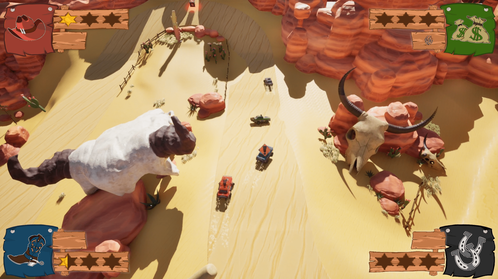

- **Team size:** 13
- **Role:** Gameplay programmer
- **Duration:** 8 weeks
{:.project-table}

For **block D** of my **first year** at **BUAS** I worked together with a team to create a 2-4 player **couch co-op** game inspired by **Mashed**. I worked as a **gameplay programmer** on the **car physics** and the **power-ups**.

<iframe frameborder="0" src="https://itch.io/embed/2724632" width="100%" height="167"><a href="https://buas.itch.io/team-salt">Dusty Mayhem by Breda University of Applied Sciences, bakje06, bean-28, dash-axe, denise-dk, desynkv, desytsv, funkyburitto, jamiejo1, luc-momber, nikolayderooij, pappaniels, pygorable, scholte</a></iframe>

##### ...WIP...
