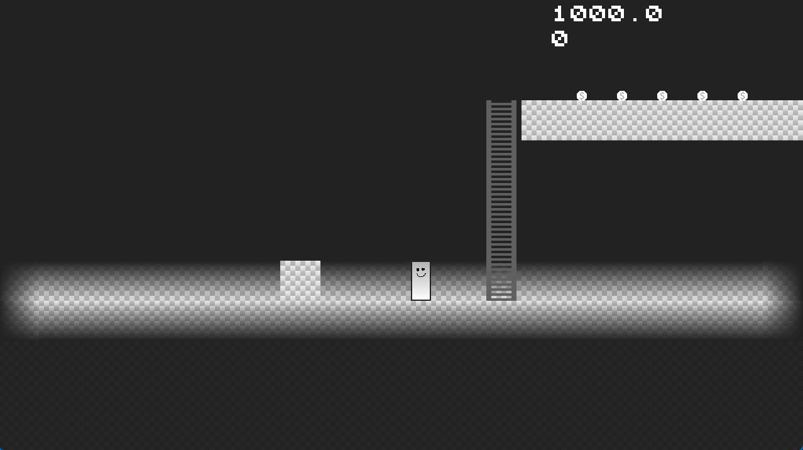

- **Solo**
- **Role:** Generalist
- **Duration:** 8 weeks
{:.project-table}

For **block A** of my **first year** at **BUAS** I created a **2D** platformer game inspired the classic game **Pitfall** in **C++**. Built on top of a basic template where I added:

- **Sprite Rendering**: Level sprites with smooth scrolling and animated sprites for the character.
- **Game object system**: OOP with inheritance and polymorphism.
- **2D Physics**: AABB Collision and forces.
- **UI**: Simple buttons and text.

##### ...WIP...
