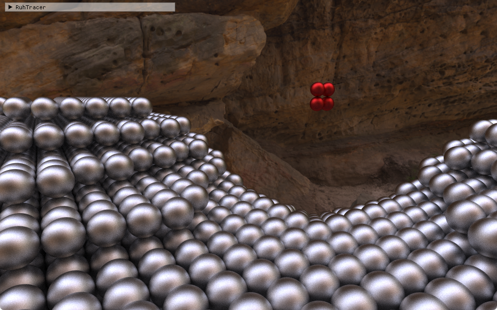

- **Solo**
- **Role:** Graphics Programmer
- **Duration:** 8 weeks
{:.project-table}

For **block C** of my **first year** at **BUAS** I created a **3D CPU raytracing** engine in **C++**. I started with a **template** that was provided which already featured basic **voxel** ray tracing. I then spent **6 weeks** adding:

- Spheres
- Spot lights
- Point lights
- Materials: diffuse, glass, metallic
- Textures
- HDR skydome that also lit up the scene
- Reprojection

For the last **2 weeks** I had to use this engine to create a small **puzzle game** that uses the **ray tracing** as its **main mechanic**.

##### ...WIP...
