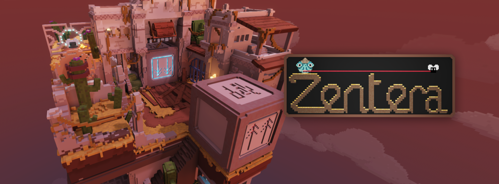

- **Team size:** 16
- **Role:** Gameplay Programmer
- **Duration:** 8 weeks
{:.project-table}

For **block D** of my **second year** at **BUAS** I worked together with a team to create a **3D voxel-based puzzle platformer**. I mainly worked as a **gameplay programmer** on the puzzle elements and the UI. Working with the engine's custom scripting (**AngleScript**) and editor.

<iframe frameborder="0" src="https://itch.io/embed/3581846" width="552" height="167"><a href="https://buas.itch.io/zentera">Zentera by Breda University of Applied Sciences, BoazBaaz, FunkyBuritto, Sven, Jon-Gear, Jaeden, Nullxiety, MΛX, Marzzy3D, fiskeduser, Lynn, bettibodrogi, LoekvdB, Mang0oo, AxelBTN, Kastrolik, bakje06</a></iframe>

##### ...WIP...
