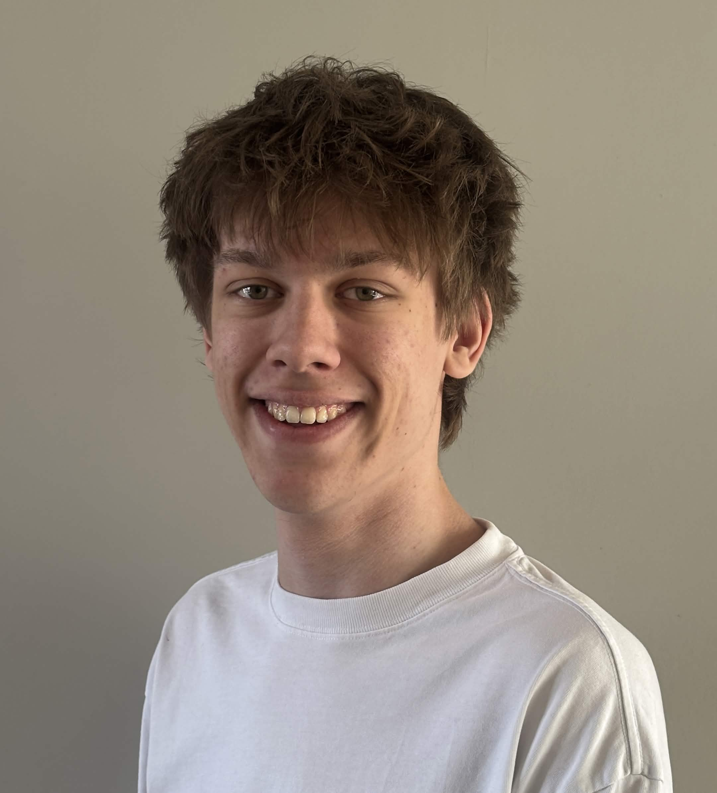

I'm a third-year **game programmer** at **Breda&nbsp;University of Applied Sciences**, focusing on **Graphics and Engine & Tools programming**.

I love working close to the metal, building renderers, optimizing performance, and creating tools that empower other developers.

**I'm looking for an internship starting September&nbsp;2026.**

<a href="/assets/Resume-Quinten-Bubberman.pdf" target="_blank">Resume</a>

<a href="https://www.linkedin.com/in/quinten-bubberman/">

</a>
<a href="https://github.com/bakjedev">

</a>

### What I work with

- **Primary Language:** C++
- **Other Languages:** Python, Rust, GLSL
- **Engines:** Unreal, Godot
- **Tools:** Git, Perforce, Rider, Visual Studio, NSight Graphics, Tracy, Linux
- **Natural Languages:** Dutch, English

## Pinned Projects 

<a href="/projects" class="more-link">More Projects</a>

## Pinned Posts

<a href="/pages" class="more-link">More Posts</a>

## Info

- Email me at [**contact@bakje.dev**](mailto:contact@bakje.dev)
- Connect with me on [**LinkedIn**](https://www.linkedin.com/in/quinten-bubberman/)
- Take a look at my <a href="/assets/Resume-Quinten-Bubberman.pdf" target="_blank">**resume**</a>
- Check out my projects on [**Github**](https://github.com/bakjedev) 

